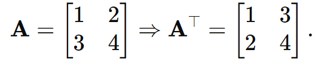
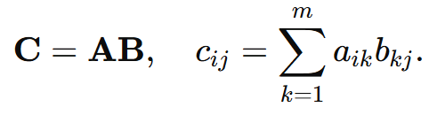
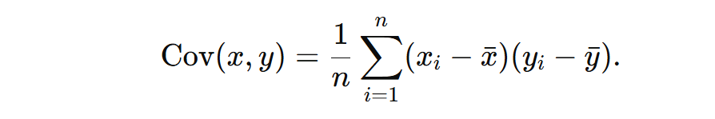

## **2.1 Álgebra Linear Essencial**

### **Matrizes, Vetores e Operações Básicas**

1. **Multiplicação Matriz-Vetor**:

- Função: Representa a transformação linear do vetor 𝑣 v pela matriz 𝐴 A. No PCA, 𝐴 A pode ser a matriz de autovetores usada para projetar os dados.

- Elementos:
    - A: Matriz que define a transformação.
    - v: Vetor a ser transformado.

2. **Multiplicação Matriz-Vetor**:

- Função: Troca as linhas pelas colunas. Útil no cálculo da matriz de covariância no PCA.
- Exemplo:

3. **Multiplicação Matriz-Matriz:**

**Função:** Combina transformações lineares ou calcula relações entre matrizes (exemplo: matriz de covariância).  
**Elementos:**  
- A: Matriz de dimensão n×m.  
- B: Matriz de dimensão m×p.  
- cij: Elemento da matriz resultante C.  

### **Autovalores e Autovetores**  

**Fórmula:**  

**Função:** Identifica direções (autovetores \( v \)) e magnitudes associadas (autovalores \( \lambda \)) que representam a maior variância nos dados.  

**Elementos:**  
- A: Matriz de covariância ou similar.  
- v: Vetor que não muda de direção sob a transformação.  
- λ: Escalar que define a magnitude do estiramento ou encolhimento.  

**Cálculo de Autovalores e Autovetores:**  
Resolver:  

onde \( I \) é a matriz identidade.  

### **Decomposição de Valores Singulares (SVD)**  

**Fórmula:**  

**Função:** Decompõe uma matriz A em componentes ortogonais (U e V) e valores singulares (Σ). No PCA, é usada para calcular os componentes principais.  

**Elementos:**  
- A: Matriz original (exemplo: dados centrados).  
- U: Matriz ortogonal (m×m).  
- Σ: Matriz diagonal com valores singulares.  
- V: Matriz ortogonal (n×n).  

## **2.2 Covariância e Correlação**  

### Covariância  
**Fórmula:**  

**Função:** Mede como duas variáveis mudam juntas. Valores positivos indicam que aumentam juntas; valores negativos indicam mudanças inversas.  

**Elementos:**  
- xi, yi: Valores individuais das variáveis x e y.  
- x̄, ȳ: Médias das variáveis x e y.  

### Matriz de Covariância  
**Fórmula:**  

**Função:** Resume a covariância entre todas as combinações de variáveis em um conjunto de dados.  

**Elementos:**  
- X: Dados centrados (com média zero).  

### **Correlação**  

**Fórmula:**  

**Função:** Mede a força e a direção da relação linear entre duas variáveis, com valores normalizados entre -1 e 1.  

**Elementos:**  
- σx, σy: Desvios padrão das variáveis x e y.  

## **2.3 Projeção de Vetores**  

### Projeção  
**Fórmula:**  

**Função:** Projeta um vetor x na direção do vetor u (normalizado). No PCA, projeta os dados nos componentes principais.  

**Elementos:**  
- x: Vetor de dados.  
- u: Direção (autovetor) de projeção.  

### Projeção no Espaço PCA  
**Fórmula:**  

**Função:** Transforma os dados para um espaço de menor dimensão.  

**Elementos:**  
- X: Dados originais.  
- P: Matriz de projeção (autovetores dos componentes principais).  

