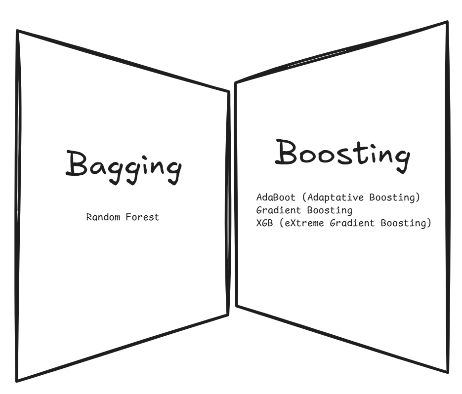
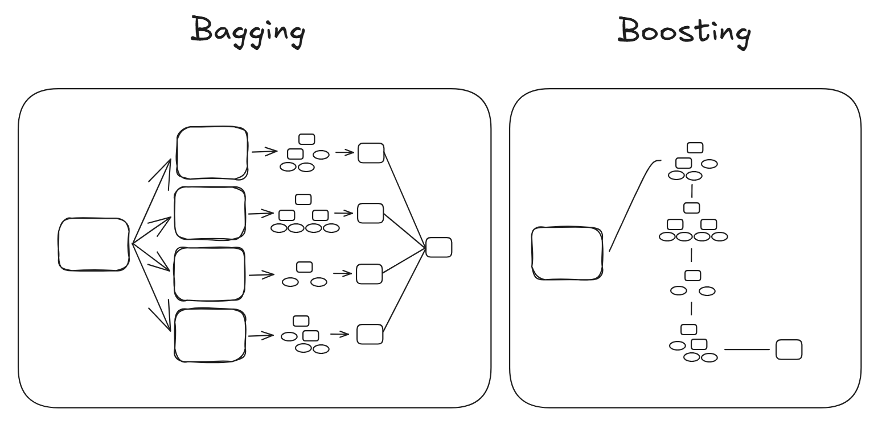
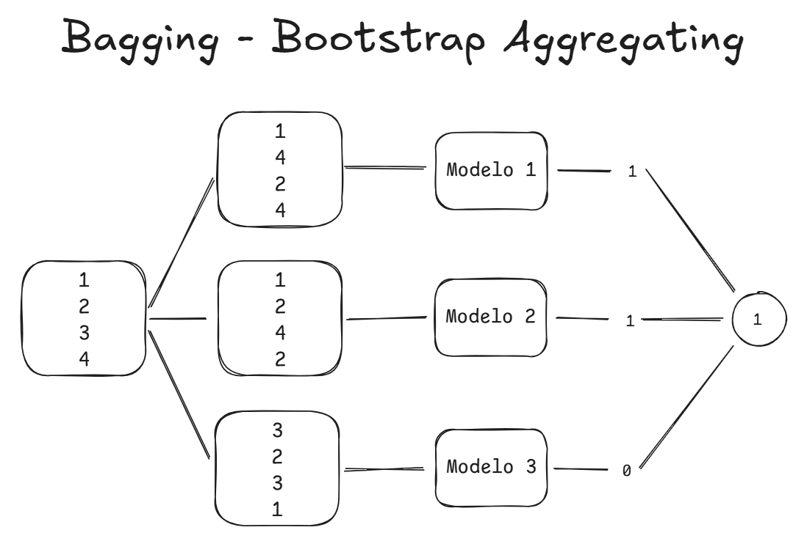
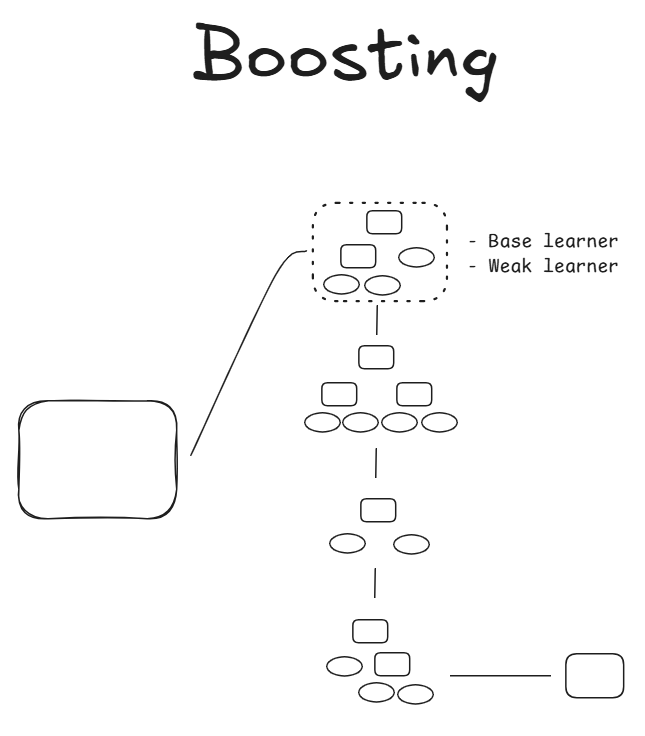

# Ensemble Techniques
Os algoritmos de ensemble são técnicas de machine learning que combinam vários modelos base para melhorar o desempenho geral do sistema. A ideia é que, ao agregar as previsões de diferentes modelos, obtém-se uma estimativa mais robusta e precisa em comparação com aquela fornecida por um único modelo.

Existem diferentes tipos de algoritmos de ensemble, mas os principais são:

- **Bagging (Bootstrap Aggregating)**:
    - **Princípio**: Constrói vários modelos base em subconjuntos aleatórios dos dados de treinamento. Cada subconjunto é obtido usando o método bootstrap (amostragem com reposição).
    - **Modelos Típicos**: Random Forest é um exemplo popular de bagging, utilizando decision trees como modelo base.
    - **Vantagem**: Reduz a variância do modelo, melhorando a estabilidade e a precisão sem aumentar significativamente o bias.
- **Boosting**:
    - **Princípio**: Constrói os modelos base um de cada vez, com cada modelo focando nos erros dos modelos anteriores. Os modelos são treinados em sequência, e cada um melhora o anterior.
    - **Modelos Típicos**: AdaBoost, Gradient Boosting, XGBoost, LightGBM e CatBoost.
    - **Vantagem**: Melhora a precisão reduzindo tanto o bias quanto a variância. É particularmente eficaz em problemas de classificação e regressão.
- **Stacking (Stacked Generalization)**:
    - **Princípio**: Combina diferentes modelos base em um nível superior por meio de um meta-modelo. Os modelos base produzem suas previsões, que são usadas como entrada para o meta-modelo.
    - **Modelo Típico**: Um exemplo é um classificador linear que usa as saídas de vários modelos base como entrada.
    - **Vantagem**: Permite aproveitar os pontos fortes de diferentes modelos para obter previsões mais precisas.
- **Blending**:
    - **Princípio**: Similar ao stacking, mas utiliza um conjunto de validação separado para treinar o meta-modelo. Não usa o conjunto de teste na criação do modelo.
    - **Vantagem**: É mais simples de implementar em comparação com o stacking e reduz o risco de overfitting no conjunto de teste.

## Timeline dos Algoritmos:

### Veja notebooks práticos desses algoritmos:

1. [**Adaboost (1997):**](https://github.com/enzoschitini/machine-learning/blob/Ensemble-Techniques/AdaBoost/AdaBoost.ipynb) Adaptive Boosting é uma implementação prática de boosting, que ajusta iterativamente o peso das observações para focar mais em instâncias difíceis de classificar.

2. [**GBM e Stochastic GBM (1999)**:](https://github.com/enzoschitini/machine-learning/blob/Ensemble-Techniques/Gradient%20Boosting%20Machine/Gradient%20Boosting%20Machine.ipynb) Gradient Boosting Machine (GBM) popularizou o uso do boosting em problemas de aprendizado de máquina. O "Stochastic GBM" introduziu randomização para aumentar a robustez.

3. [**Random Forest (2001)**:](https://github.com/enzoschitini/machine-learning/blob/Ensemble-Techniques/Random%20Forest/Random%20Forest.ipynb) Um dos métodos de ensemble mais conhecidos, combina múltiplas árvores de decisão (criado a partir de amostras bootstrap) para melhorar a generalização, introduzindo aleatoriedade na seleção de features.

4. [**XGBoost (2014-2016)**:](https://github.com/enzoschitini/machine-learning/blob/Ensemble-Techniques/XGBoost%20%E2%80%93%20Extreme%20Gradient%20Boosting/XGBoost%20%E2%80%93%20Extreme%20Gradient%20Boosting.ipynb) Extreme Gradient Boosting é uma implementação eficiente e escalável do GBM, amplamente utilizada devido à sua velocidade e desempenho em competições como o Kaggle.

5. **LightGBM (2017)**: Uma versão otimizada do GBM, projetada para ser rápida e eficiente em memória, especialmente para grandes conjuntos de dados.

6. **CatBoost (2017)**: Algoritmo especializado para lidar com dados categóricos de forma eficiente, reduzindo a necessidade de pré-processamento.

A linha do tempo representa a evolução desses métodos, mostrando como as ideias se acumularam e evoluíram ao longo dos anos para oferecer soluções mais eficientes e poderosas em aprendizado de máquina.

## Vantagens dos Algoritmos de Ensemble:

- **Melhoria da Precisão**: Ao agregar vários modelos, tende-se a reduzir o erro global.
- **Robustez**: Os modelos de ensemble são menos suscetíveis ao overfitting em comparação com modelos individuais.
- **Flexibilidade**: Podem combinar modelos de diferentes tipos, aproveitando suas características complementares.

## Desvantagens:

- **Complexidade Computacional**: Os algoritmos de ensemble podem ser mais complexos e demandar mais recursos computacionais.
- **Dificuldade na Interpretabilidade**: Como combinam vários modelos, pode ser difícil interpretar o comportamento geral do sistema.

Em resumo, os algoritmos de ensemble são uma estratégia poderosa para melhorar o desempenho dos modelos de machine learning, aproveitando a diversidade e a sinergia entre diferentes modelos base.
---
## Diferença entre algoritmos de Bagging e Boosting:

Os métodos de Bagging e Boosting são ambos técnicas de ensemble learning utilizadas para melhorar o desempenho dos modelos de machine learning. No entanto, **diferem significativamente na forma como combinam os modelos base** (frequentemente chamados de "weak learners" ou "base learners") para criar um modelo mais robusto e preciso.

- **Processo de Treinamento**: O **Bagging** treina modelos base **de forma independente e paralela**, enquanto o **Boosting** treina modelos base **de forma sequencial**, com cada modelo focando nos pontos fracos dos modelos anteriores.
- **Atualização de Pesos**: O **Boosting atualiza os pesos dos exemplos durante o treinamento** para se concentrar nos erros, enquanto o **Bagging trata todos os subconjuntos de dados de treinamento de forma equivalente.**
- **Combinação de Modelos**: O **Bagging** combina modelos base por meio de uma **agregação simples**, enquanto o **Boosting** combina modelos base **de forma que cada um contribua com um peso variável**, geralmente baseado em seu desempenho.

Em resumo, embora ambos os métodos se baseiem na ideia de combinar modelos base para melhorar o desempenho do modelo final, suas abordagens para o amostramento de dados, o treinamento dos modelos e o tratamento de erros os tornam distintos na prática e adequados para diferentes contextos de machine learning.
---
## O que é Bagging?

O Bagging, abreviação de "Bootstrap Aggregating", é uma técnica de ensemble utilizada no aprendizado de máquina para melhorar a precisão e a estabilidade dos modelos preditivos. A ideia principal é reduzir a variabilidade e evitar o overfitting combinando vários modelos base, geralmente do mesmo tipo.

**Ex. Random Forest**

Eis um resumo dos principais passos e conceitos por trás do Bagging:

1. **Amostragem com reposição**: O Bagging começa criando várias amostras bootstrap a partir do banco de dados original. Cada amostra é gerada aleatoriamente com reposição, o que significa que algumas observações podem aparecer mais de uma vez na mesma amostra, enquanto outras podem não aparecer.
2. **Treinamento independente de modelos**: Para cada amostra bootstrap, um modelo base é treinado separadamente. Normalmente, esses modelos são do mesmo tipo, como decision trees, mas isso não é uma regra fixa.
3. **Agregação de resultados**: Após treinar os modelos em diferentes amostras, os resultados são combinados para fazer a previsão final. Em problemas de classificação, isso geralmente envolve votação majoritária (onde se escolhe a classe mais comum entre os modelos). Em problemas de regressão, calcula-se a média das previsões dos modelos.
4. **Redução da variância**: O Bagging ajuda a reduzir a variância do modelo, pois a diversidade entre os modelos treinados em diferentes subconjuntos de dados tende a neutralizar os erros específicos de cada modelo. Isso é especialmente eficaz para modelos propensos a overfitting, como os decision trees.

**Exemplo comum**: Um exemplo famoso de método Bagging é o Random Forest, no qual vários decision trees são construídos a partir de amostras bootstrap, e cada árvore é treinada com um subconjunto aleatório de características. A previsão final é feita com base na média das previsões das árvores ou por votação majoritária.

**Vantagens do Bagging**:

- Redução do overfitting.
- Melhor generalização do modelo.
- Maior robustez e precisão.

**Limitações do Bagging**:

- Pode ser mais exigente computacionalmente, pois requer a construção de vários modelos.
- Não melhora a capacidade do modelo de capturar relações complexas nos dados.

O Bagging é uma técnica poderosa e amplamente utilizada em problemas de aprendizado supervisionado para melhorar o desempenho de modelos preditivos.
## O que é **Boosting**?

O boosting é uma das ideias de aprendizado mais poderosas introduzidas nos últimos vinte anos. Inicialmente projetado para problemas de classificação, pode ser estendido com sucesso também para regressão. A motivação por trás do boosting é uma abordagem que combina os resultados de muitos classificadores "fracos" para produzir um "comitê" poderoso. Nesse sentido, o boosting compartilha semelhanças com o bagging e outras abordagens baseadas em comitês. No entanto, veremos que a conexão é, na melhor das hipóteses, superficial, e o boosting é fundamentalmente diferente.

**Ex. AdaBoost (Adaptive Boosting), Gradient Boosting, XGB (eXtreme Gradient Boosting)**

*Hastie, Tibshirani, Friedman, 2000*

O algoritmo de **Boosting** é uma técnica de aprendizado de máquina usada para melhorar o desempenho dos modelos preditivos. Sua ideia fundamental é combinar vários modelos fracos para criar um modelo forte. Aqui está uma explicação detalhada de como funciona:

### Princípios Básicos

1. **Modelos Fracos**: O Boosting começa com um conjunto de modelos fracos, ou seja, modelos que são apenas ligeiramente melhores que o acaso. Estes podem ser simples, como pequenas árvores de decisão (também chamadas de "stumps", quando têm apenas um nível de profundidade).
2. **Modelo Aditivo**: O Boosting constrói o modelo final de forma incremental, adicionando um modelo fraco de cada vez ao conjunto. Cada novo modelo é treinado para corrigir os erros do modelo combinado anterior.
3. **Ponderação dos Erros**: Em cada iteração, os dados que foram classificados erroneamente pelos modelos anteriores recebem um peso maior, para que os modelos subsequentes se concentrem nesses casos difíceis.

Esses princípios permitem que o boosting crie um modelo poderoso, mesmo quando os modelos individuais são relativamente fracos. O processo iterativo e a ênfase em corrigir os erros a cada etapa são o que tornam o boosting eficaz.
## Algoritmos de Boosting

Existem várias variantes de Boosting, incluindo:

1. **AdaBoost (Adaptive Boosting)**:
    - Inicialmente atribui um peso igual a todas as observações.
    - Após cada iteração, atualiza os pesos das observações: aumenta o peso das que foram classificadas incorretamente e diminui o peso das que foram classificadas corretamente.
    - O novo modelo é treinado com o conjunto de dados ponderado.
    - A combinação final dos modelos é uma soma ponderada das previsões de cada modelo fraco.
2. **Gradient Boosting**:
    - Começa com um modelo inicial (geralmente uma previsão simples da média).
    - A cada iteração, treina um novo modelo sobre os erros residuais do modelo atual (a diferença entre as previsões do modelo atual e os valores reais).
    - O modelo final é a soma dos modelos treinados, com cada modelo adicional tentando melhorar a precisão do modelo anterior, reduzindo os erros residuais.

### Aplicações e Vantagens

- **Robustez e Precisão**: O Boosting é conhecido por sua alta precisão e robustez. É particularmente eficaz quando se trabalha com modelos fracos, melhorando significativamente o desempenho geral.
- **Flexibilidade**: Pode ser aplicado a vários tipos de modelos fracos, não apenas às árvores de decisão.
- **Minimização dos Erros**: Através da atenção iterativa aos erros, o Boosting pode lidar bem com dados ruidosos e complexos.

### Considerações

- **Overfitting**: Se não ajustado corretamente, o Boosting pode se sobreajustar aos dados de treinamento. Para evitar isso, técnicas de regularização são frequentemente utilizadas, como o redimensionamento dos pesos dos modelos adicionais.
- **Tempo de Computação**: O processo iterativo e o treinamento múltiplo de modelos podem ser computacionalmente caros e demorados.

### Implementações Populares

- **Scikit-learn**: Fornece implementações de AdaBoost e Gradient Boosting.
- **XGBoost**: Uma biblioteca de Gradient Boosting altamente otimizada que oferece excelente desempenho e escalabilidade.
- **LightGBM**: Outra biblioteca de Gradient Boosting, projetada para ser eficiente e rápida.
- **CatBoost**: Otimizada para dados categóricos e muito utilizada em competições de machine learning.

Em resumo, o Boosting é uma técnica poderosa de machine learning que melhora a precisão dos modelos combinando múltiplos modelos fracos, focando iterativamente nos erros para construir um modelo forte e preciso.
---
## Comparação entre os algoritmos de cada modelo

Aqui está uma tabela que resume as principais aplicações de Random Forest, AdaBoost, Gradient Boosting Machine (GBM) e XGBoost:

| **Algoritmo** | **Principais Aplicações** |
| --- | --- |
| **Random Forest** | - Classificação de e-mails (spam/não spam) **/////** - Previsão de risco de crédito **/////** - Detecção de anomalias nos dados **/////** - Previsão de diagnósticos médicos **/////** - Classificação de dados biológicos |
| **AdaBoost** | - Detecção de rostos em imagens **/////** - Classificação de dados biomédicos **/////** - Detecção de objetos em vídeos de vigilância **/////** - Previsão de reincidência de pacientes **/////** - Classificação de imagens de satélite |
| **Gradient Boosting Machine (GBM)** | - Previsão da taxa de clique para anúncios online **/////** - Análise de sentimentos nas redes sociais **/////** - Previsão da demanda de energia elétrica **/////** - Análise de séries temporais financeiras **/////** - Previsão de comportamentos de usuários online |
| **XGBoost (Extreme Gradient Boosting)** | - Previsão de preços de ações **/////** - Previsão de churn de clientes **/////** - Classificação de tweets do Twitter **/////** - Previsão da rentabilidade do cliente **/////** - Previsão de sobrevida de pacientes |

Aqui está a tabela que compara as principais diferenças entre Random Forest, AdaBoost, Gradient Boosting Machine (GBM) e XGBoost:

| **Características** | **Random Forest** | **AdaBoost** | **Gradient Boosting Machine (GBM)** | **XGBoost (Extreme Gradient Boosting)** |
| --- | --- | --- | --- | --- |
| **Tipo de Modelo** | Ensemble de Árvores de Decisão | Ensemble de Modelos (geralmente árvores de decisão) | Ensemble de Modelos (geralmente árvores de decisão) | Ensemble de Modelos (geralmente árvores de decisão) |
| **Método de Ensemble** | Bagging (Bootstrap Aggregating) | Boosting | Boosting | Boosting |
| **Combinação das Previsões** | Média das previsões das árvores | Soma ponderada dos modelos sequenciais | Soma dos modelos sequenciais | Soma dos modelos sequenciais |
| **Peso das Árvores** | Cada árvore tem o mesmo peso | Os modelos são ponderados com base no desempenho | Os modelos são ponderados com base no desempenho | Os modelos são ponderados com base no desempenho |
| **Construção das Árvores** | Árvores construídas independentemente com amostragem bootstrap | Modelos construídos sequencialmente, corrigindo os erros dos modelos anteriores | Modelos construídos sequencialmente, corrigindo os erros dos modelos anteriores | Modelos construídos sequencialmente, corrigindo os erros dos modelos anteriores |
| **Overfitting** | Reduzido devido à média dos resultados | Pode ocorrer overfitting se não bem ajustado | Pode ocorrer overfitting se não bem ajustado | Reduzido devido à regularização avançada e pruning |
| **Velocidade de Treinamento** | Rápido (pode ser paralelizado) | Lento | Lento | Rápido (otimizado para eficiência e pode ser paralelizado) |
| **Velocidade de Predição** | Rápido | Rápido | Lento | Rápido |
| **Robustez a Dados Ruidosos** | Alta | Baixa sem regularização | Moderada | Alta |
| **Gestão de Valores Faltantes** | Bem gerido (árvores independentes) | Não bem gerido | Não bem gerido | Bem gerido (suporte integrado) |
| **Interpretabilidade** | Moderada (difícil de interpretar muitas árvores) | Baixa | Baixa | Moderada |
| **Principais Parâmetros de Ajuste** | Número de árvores, profundidade das árvores | Número de modelos, learning rate | Número de modelos, learning rate, profundidade das árvores | Número de modelos, learning rate, profundidade das árvores, parâmetros de regularização |
| **Principais Vantagens** | Robusto, reduz overfitting, simples de usar | Boas performances com poucos modelos | Alta acurácia, otimizado | Alta acurácia, muito eficiente, regularização avançada |
| **Principais Desvantagens** | Nem sempre é o mais preciso, interpretabilidade limitada | Sensível a dados ruidosos, requer bom ajuste | Lento para treinar, complexo de ajustar | Complexo de ajustar, requer recursos computacionais |

Esta tabela fornece uma visão geral das principais diferenças entre esses quatro populares algoritmos de aprendizado de máquina ensemble, cada um com seus próprios pontos fortes e fracos, dependendo da aplicação específica.

Aqui estão cinco aplicações reais nas quais o **Random Forest**, **AdaBoost**, **Gradient Boosting Machine (GBM)** e **XGBoost** são preferidos em relação aos outros:

1. **Random Forest**:
    - **Aplicação 1**: Classificação de e-mails como spam ou não spam.
    - **Motivo**: A capacidade de lidar com grandes conjuntos de características e a resistência ao overfitting tornam o Random Forest ideal para a classificação de dados textuais complexos, como e-mails.
    - **Aplicação 2**: Previsão de risco de crédito para empréstimos bancários.
    - **Motivo**: O Random Forest é eficaz em lidar com dados heterogêneos, como histórico de crédito, renda, ocupação, etc., fornecendo uma avaliação robusta e equilibrada do risco.
2. **AdaBoost**:
    - **Aplicação 1**: Detecção de rostos em imagens para biometria.
    - **Motivo**: O AdaBoost é adequado para melhorar a precisão na detecção de características complexas e variáveis, como rostos, em contextos de segurança e identificação.
    - **Aplicação 2**: Classificação de dados biomédicos para diagnóstico de doenças.
    - **Motivo**: O AdaBoost é útil quando é necessária alta precisão na classificação de dados de natureza variada (como imagens de exames, dados genômicos) para fornecer diagnósticos precisos e rápidos.
3. **Gradient Boosting Machine (GBM)**:
    - **Aplicação 1**: Previsão da taxa de cliques para anúncios publicitários online.
    - **Motivo**: O GBM é eficaz em combinar informações de diferentes fontes (como dados demográficos, comportamentais e de navegação na web) para melhorar a precisão na previsão do comportamento dos usuários.
    - **Aplicação 2**: Análise de sentimentos nas redes sociais para monitorar a percepção da marca.
    - **Motivo**: O GBM é adequado para analisar grandes volumes de texto não estruturado de redes sociais, a fim de identificar tendências de opinião e sentimentos em relação a uma marca ou produto.
4. **XGBoost (Extreme Gradient Boosting)**:
    - **Aplicação 1**: Previsão da demanda de energia elétrica para o planejamento da distribuição de energia.
    - **Motivo**: O XGBoost é eficiente ao lidar com dados temporais complexos e variáveis, integrando parâmetros de regularização para prever com precisão a demanda futura de energia.
    - **Aplicação 2**: Previsão dos preços das ações para o trading algorítmico.
    - **Motivo**: O XGBoost é ideal para a análise de grandes conjuntos de dados financeiros e a previsão dos movimentos dos preços das ações, utilizando características como tendências históricas e indicadores técnicos.

Cada aplicação destaca como esses algoritmos são usados para diferentes fins em contextos reais, aproveitando suas características únicas de gerenciamento de dados, robustez e capacidade de adaptação às necessidades específicas de análise e previsão.